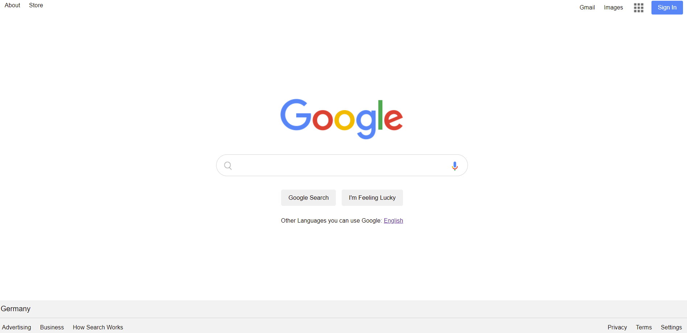

#  :mag_right: Landing-Page-Google :mag_right:
> Google Landing Page is a replication of Google landing page to practice CSS

## Table of contents
  - [Table of contents](#table-of-contents)
  - [General info](#general-info)
  - [Technologies](#technologies)
  - [Features](#features)
  - [How to use](#how-to-use)
  - [Screenshots](#screenshots)
  - [Contact](#contact)

## General info
This project is created to sharpen the knowledge and use of CSS. It is a Project of The Clarusway IT School - Fullstack Developer Path.

## Technologies
* HTML
* CSS

## Features
* Has a navbar area,
* an input area,
* two buttons and
* footer part

## How to use
Click on this [link](https://i-bilge.github.io/Landing-Page-Google/)

## Screenshot

## Contact
:mailbox_with_mail: You can send me email : iismailbilge@gmail.com :mailbox_with_mail:
